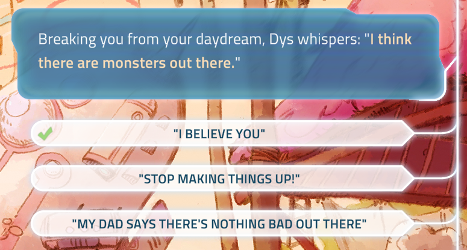
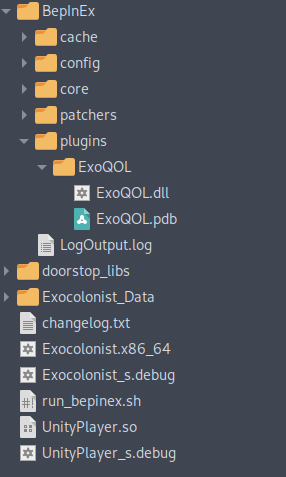

# ExoQOL

_A quality of life mod for I Was a Teenage Exocolonist_

This mod is currently a work in progress - check back soon for more features and
information!

## Features

### Always show seen text indicators

Checkmarks for choices that have been selected before will always appear, even
when the "skip seen text" setting is disabled.

## Installation

ExoQOL is designed to be easy to install:

1. First, install BepInEx 5. Instructions for this step can be found in the
   [BepInEx documentation](https://docs.bepinex.dev/v5.4.21/articles/user_guide/installation/index.html).
2. Run the game once, then close it. This should create several folders in the
   game directory.
3. Finally, download the [latest release of ExoQOL](https://github.com/dmarcuse/ExoQOL/releases/latest)
   (not the source code), unzip it, and then copy the folder into
   `BepInEx/plugins`. You should end up with a folder structure like the
   screenshot below.

